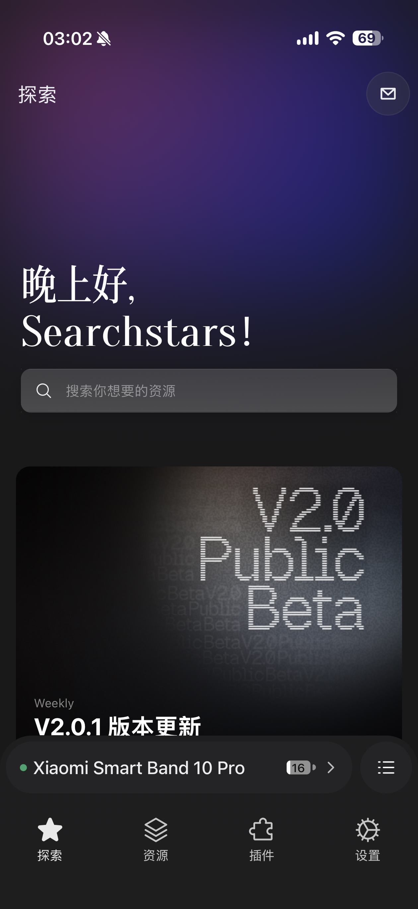
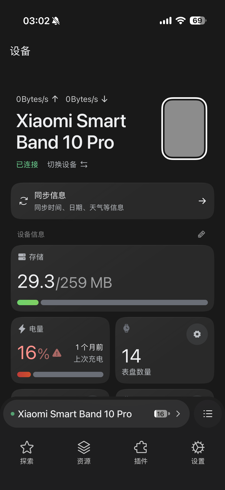
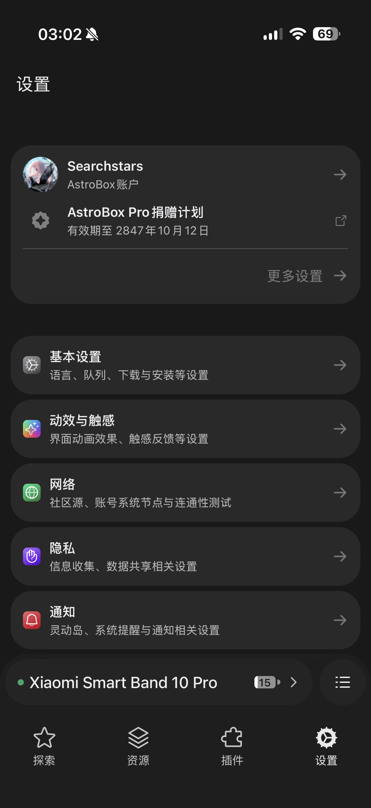

<p align="center">
    
</p>
<h1 align="center">AstroBox</h1>
<p align="center">Rust 驱动的下一代可穿戴生态工具箱，聚焦第三方应用的安装、调试与分发。</p>
<p align="center">
    <a href="https://github.com/AstralSightStudios/AstroBox-Public">Legacy 版本</a> ·
    <a href="src-tauri">Rust Workspace</a> ·
    <a href="web">Web 前端</a>
</p>
<p align="center">
    
    
    
    
</p>

---

> 这是 AstroBox (Legacy) 的完全重构版本，AstroBox-NG (next-generation) 将继续演化为一个可插拔、跨平台、极速部署的穿戴设备强力辅助工具。

## 项目成就
该项目达成了多个“全球首个”，具体有：
1.	全球首个使用 Rust 语言 **同时在 Windows、macOS、Linux、Android** 等多平台上实现 **经典蓝牙 SPP 通信** 的项目，实现了系统级跨平台蓝牙协议统一。
2.	全球首个在 **PC 与 iOS 平台** 上成功实现 **小米穿戴设备连接及第三方资源安装** 的项目，打破了官方生态封闭限制，构建出开放互联的新范式。
3.	全球首个使用 Rust 语言实现 **基于 Vela 系统的小米穿戴设备蓝牙通信协议栈近 99% 完整还原** 的项目。
4.	全球首个将 **WIT + WebAssembly System Interface（WASI**） 驱动的插件系统 **深度集成进 Tauri 应用** 并投入移动端使用的生产环境的项目，开创了桌面与 WebAssembly 融合的新形态。

## 技术特性
1. 核心与平台无关，使用高可扩展性的ECS架构，支持多设备同时连接
2. App端基于Tauri框架，可在Windows、macOS、Linux、Android、iOS五大平台上运行
3. Core针对WebAssembly特别适配，支持浏览器端与单片机平台运行
4. 基于wit / wasi技术栈的插件系统，提供近乎原生级别的插件性能
5. 具有抽象IPC层的由Rsbuild + React构建的现代化Web前端

## 实机效果

<p align="center">
    <a href="images/screenshot_home.png">
        
    </a>
    <a href="images/screenshot_resources.png">
        
    </a>
    <a href="images/screenshot_device.png">
        
    </a>
    <a href="images/screenshot_settings.png">
        
    </a>
</p>

## 下载

<p align="center">
    <a href="https://apps.apple.com/us/app/astrobox-wearable-toolkit/id6785374105">
        
    </a>
    &nbsp;
    <a href="https://github.com/AstralSightStudios/AstroBox-NG/releases">
        
    </a>
</p>

## 项目架构
基于团队自行开发的多仓管理工具 [ABTools](./abtools) 进行多仓库开发，其中部分仓库开源，部分闭源。

## 开源协议 / License
此项目以AGPL 3.0授权，但包含额外条款。
This project is licensed under AGPL 3.0, but includes additional terms.

### 额外条款 / Additional Terms
根据AGPL 3.0所述可选附加条款，本项目额外附加署名要求，使用此项目需在遵守AGPL 3.0条款后额外为此项目添加署名，署名包括但不限于本项目仓库地址，作者名等。

注: 附加条款以中文版为准，其他语言仅供参考！

According to the optional additional terms stated in AGPL 3.0, this project includes an additional attribution requirement. When using this project, after complying with the terms of AGPL 3.0, you must also add attribution for this project, which includes but is not limited to the project repository address, the author's name, etc.

Note: The additional terms are based on the Chinese version. Other languages are for reference only!

## 快速上手

### 环境要求
- Rust Toolchain 1.90.0+（需启用 2024 edition 与 resolver = "3"）
- Python 3
- Node.js 与 [pnpm](https://pnpm.io/)（**强制使用 pnpm**）
- Git（别让我发现你没装它）

### 克隆仓库
```shell
git clone https://github.com/AstralSightStudios/AstroBox-NG
cd AstroBox-NG
```

### 初始化工作区
```shell
python abtools.py init

# 拥有私有模块访问权限时：
python abtools.py init --private
```

## 开发

> 在执行任何编译操作前，请确保 Rust 工具链满足最低版本要求。

### CoreLib
```shell
cargo test -p corelib --manifest-path src-tauri/Cargo.toml
```

### Tauri App（闭源）
```shell
python abtools.py dev --tauri
```
